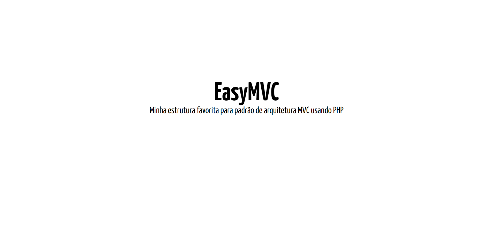

# EasyMVC - Aplicação para Demonstração de Estrutura PHP
    

Aplicação Web de demonstração da estrutura que mais utilizo para a linguagem PHP, seguindo o paradigma de Programação Orientação a Objetos e o Padrão de Arquitetura MVC.

## Ferramentas e Tecnologias

- HTML - Linguagem de Marcação;
- CSS - Folhas de Estilo;
- PHP - Linguagem de Programação;
- MySQL - Sistema de Gerenciamento de Banco de Dados.

  

